# FBM Defect Pattern Multi-Label Classification

Wafer chip **Fail Bit Map(FBM)** 이미지에서 불량 패턴을 감지하는 Multi-Label CNN 분류 시스템입니다.

단일 패턴뿐 아니라 **2개 이상의 불량 패턴이 중첩된 이미지**에서도 각 패턴을 독립적으로 감지할 수 있으며, **4가지 학습 전략**을 비교 평가하여 최적의 중첩 불량 분류 방법론을 도출합니다.

---

## Table of Contents

- [Problem Statement](#problem-statement)
- [Defect Pattern Classes (7종)](#defect-pattern-classes-7종)
- [Experiment Design](#experiment-design)
- [Results](#results)
- [Analysis & Insights](#analysis--insights)
- [Visualization](#visualization)
- [Model Architecture](#model-architecture)
- [Project Structure](#project-structure)
- [Quick Start](#quick-start)
- [License](#license)

---

## Problem Statement

반도체 웨이퍼 FBM 이미지에서 **불량 패턴을 자동 분류**하는 것이 목표입니다.

실제 현장에서는 **2개 이상의 불량이 동시에 발생**(중첩 불량)하는 경우가 빈번하며, 기존 단일 분류 모델로는 이를 정확히 감지하기 어렵습니다.

### 핵심 질문

> **"중첩 불량을 더 잘 분류하기 위한 최적의 학습 전략은 무엇인가?"**

이를 검증하기 위해 **4가지 평가 조건**을 설계하고, **Binary Classification (각 클래스 독립 이진 분류)** 기반의 Multi-Label 접근법으로 실험을 수행했습니다.

---

## Defect Pattern Classes (7종)

| Class | 설명 | Sample |
|---|---|---|
| `row_line` | 로우 방향 라인 불량 (수평 스트라이프) | 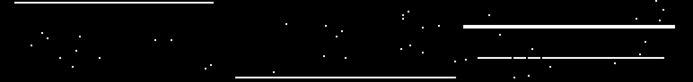 |
| `col_line` | 컬럼 방향 라인 불량 (수직 스트라이프) | 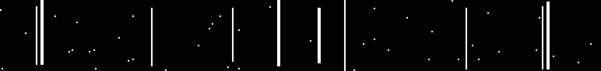 |
| `corner_rect` | 모서리 사각형 불량 | 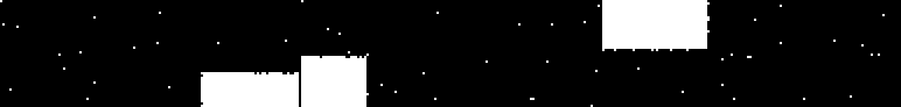 |
| `nail` | 손톱/반달 형태 불량 (타원형) | 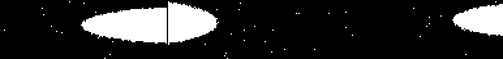 |
| `edge` | 가장자리 불량 | 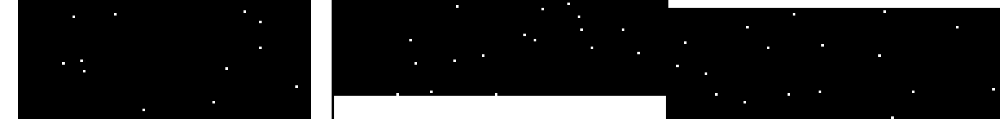 |
| `block` | 블록 형태 불량 |  |
| `scatter` | **랜덤 산포 불량** (신규 추가) | 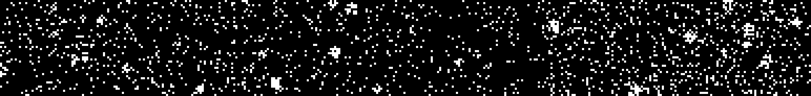 |

### 중첩 패턴 예시

| 조합 | Sample |
|---|---|
| `row_line` + `nail` | 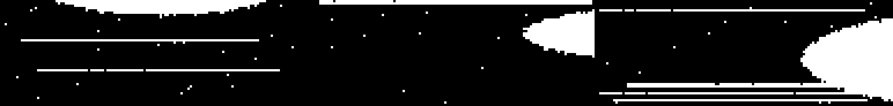 |
| `corner_rect` + `block` |  |
| `col_line` + `scatter` | 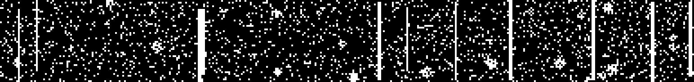 |
| `edge` + `scatter` | 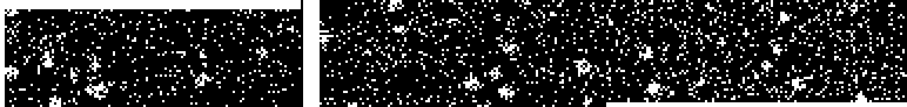 |

> **FBM Image Size**: 128 x 46 pixels (Grayscale)
>
> **Scatter 패턴**: 5~15% 밀도의 랜덤 산포 + 소규모 클러스터로 구성된 랜덤성 결함

---

## Experiment Design

### 평가 Metrics

| Metric | 정의 | 의미 |
|---|---|---|
| **Subset Accuracy** (Exact Match) | 7개 레이블 벡터가 **완전히 일치**하는 비율 | 엄격한 기준 — 하나라도 틀리면 오답 |
| **Hamming Accuracy** | 개별 레이블의 정확도 평균 (1 - Hamming Loss) | 유연한 기준 — 레이블 단위 정확도 |

### 4가지 평가 조건

| 평가 | 학습 데이터 | 모델 | 핵심 의도 |
|---|---|---|---|
| **Eval 1** | 단일 패턴만 (2,040장) | CNN Classifier | Baseline — 단일만 보고 중첩을 맞출 수 있는가? |
| **Eval 2** | 단일 + 합성 중첩 (2,922장) | CNN Classifier | 합성 중첩 데이터의 효과 검증 |
| **Eval 3** | 단일 + 합성 중첩 + **마스킹** (2,922장) | CNN Classifier | Occlusion 내성 향상 (Cutout Augmentation) |
| **Eval 4** | Eval 1~3 중 최적 조건의 데이터 | **Spatial Attention Detection** 모델 | Object Detection 기법 적용 효과 |

### 공통 조건

| 항목 | 값 |
|---|---|
| Epochs | 30 |
| Batch Size | 32 |
| Learning Rate | 0.001 (StepLR: step=10, gamma=0.5) |
| Loss | BCEWithLogitsLoss |
| Optimizer | Adam |
| Threshold | 0.5 |
| GPU | NVIDIA RTX 3080 |
| Mixed Precision | FP16 (AMP) |

### 테스트셋 구성

| 테스트셋 | 이미지 수 | 구성 |
|---|---|---|
| **test_single** | 360장 | 단일 패턴 7종 + 정상 |
| **test_composite** | 378장 | 2-패턴 중첩 (C(7,2)=21 조합) |

---

## Results

### 종합 성능 비교

| 평가 조건 | 단일 불량<br>Subset Acc | 단일 불량<br>Hamming Acc | 중첩 불량<br>Subset Acc | 중첩 불량<br>Hamming Acc |
|---|:---:|:---:|:---:|:---:|
| **Eval 1** (단일학습) | 99.2% | 99.9% | **29.6%** | 89.8% |
| **Eval 2** (합성중첩) | 98.9% | 99.8% | 87.6% | 98.1% |
| **Eval 3** (마스킹) | 99.4% | 99.9% | 84.7% | 97.7% |
| **Eval 4** (Detection) | **99.7%** | **100.0%** | **88.1%** | **98.1%** |

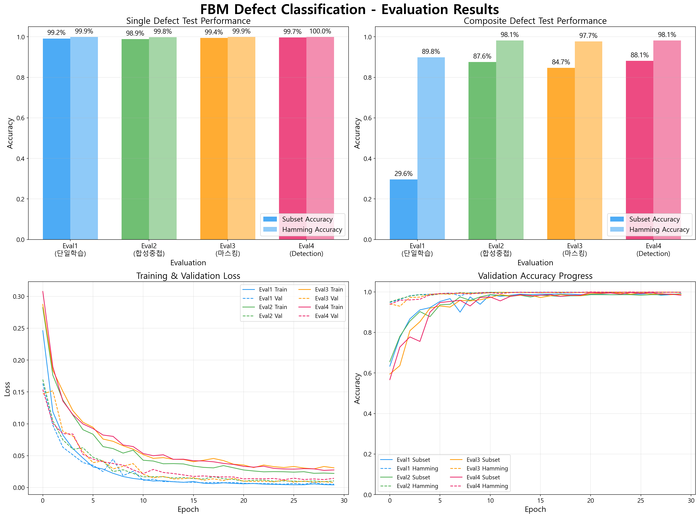

### 클래스별 정확도 (중첩 불량 테스트)

| 클래스 | Eval1 | Eval2 | Eval3 | Eval4 |
|---|:---:|:---:|:---:|:---:|
| `row_line` | 91.8% | **98.4%** | 97.4% | 98.7% |
| `col_line` | 88.1% | 97.4% | 96.8% | **98.4%** |
| `corner_rect` | 85.7% | **96.0%** | 95.5% | 95.2% |
| `nail` | 87.0% | **98.4%** | 97.4% | 97.4% |
| `edge` | 84.4% | 97.4% | **97.6%** | **97.9%** |
| `block` | 93.1% | **99.5%** | 99.2% | **99.5%** |
| `scatter` | 98.7% | **100.0%** | **100.0%** | **100.0%** |

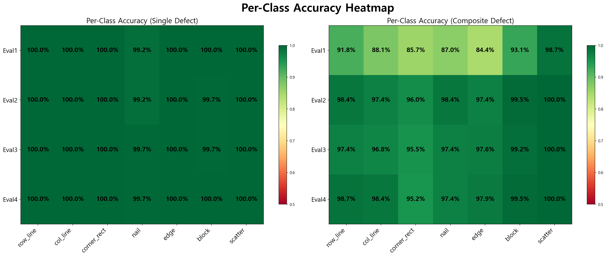

### 클래스별 F1 Score (중첩 불량 테스트)

> F1 Score = 2 × (Precision × Recall) / (Precision + Recall). Precision과 Recall의 조화 평균으로, 두 지표가 모두 높아야 높은 값을 가짐.

| 클래스 | Eval1 | Eval2 | Eval3 | Eval4 |
|---|:---:|:---:|:---:|:---:|
| `row_line` | 0.787 | 0.967 | 0.976 | **0.981** |
| `col_line` | 0.766 | 0.946 | 0.957 | **0.981** |
| `corner_rect` | 0.620 | **0.930** | 0.920 | 0.916 |
| `nail` | 0.654 | **0.967** | **0.967** | 0.947 |
| `edge` | 0.579 | 0.952 | 0.936 | **0.958** |
| `block` | 0.839 | 0.986 | 0.962 | **0.991** |
| `scatter` | 0.981 | **1.000** | **1.000** | **1.000** |

---

## Analysis & Insights

### 1. 단일 패턴만으로는 중첩 불량을 분류할 수 없다 (Eval 1)

- 단일 불량 분류: **99.2%** (매우 우수)
- 중첩 불량 분류: **29.6%** (사실상 실패)

> **핵심 원인**: Precision은 높지만 (98~100%) **Recall이 40~65%로 극도로 낮음**
>
> → 모델이 중첩 이미지에서 "하나의 패턴만 감지"하고 나머지를 놓침
> → 특히 `edge`(41%), `corner_rect`(45%)는 다른 패턴에 가려져 감지 실패

**결론**: 단일 패턴 학습만으로는 중첩 상황에서의 **패턴 공존(co-occurrence)** 을 학습하지 못함.

### 2. 합성 중첩 데이터가 가장 큰 성능 향상을 가져온다 (Eval 2)

- 중첩 Subset Accuracy: 29.6% → **87.6%** (**+58.0%p**)
- 중첩 Hamming Accuracy: 89.8% → **98.1%** (+8.3%p)

> **핵심 요인**: 단순 OR 합성 방식으로 중첩 이미지를 만들어 학습에 포함한 것만으로도 **Recall이 모든 클래스에서 90%+ 수준으로 향상**
>
> → 모델이 "두 패턴이 동시에 존재할 수 있다"는 것을 학습
> → 가장 비용 대비 효과가 큰 전략

**결론**: 실제 중첩 데이터가 부족하더라도, 합성 데이터로 대체 가능. **데이터 합성이 핵심 전략.**

### 3. 마스킹 학습은 이 데이터셋에서 추가 효과가 제한적이다 (Eval 3)

- 중첩 Subset Accuracy: 87.6% (Eval2) → **84.7%** (Eval3) (-2.9%p)

> **분석**: Cutout 마스킹이 occlusion 내성을 높이려는 의도였으나, 오히려 소폭 하락
>
> **원인 추정**:
> 1. FBM 이미지가 128x46으로 작아, 마스킹 영역이 상대적으로 너무 넓어 핵심 특징 파괴
> 2. FBM의 바이너리 특성상, 일반 자연 이미지 대비 마스킹 정규화의 효과가 작음
> 3. Eval2에서 이미 합성 데이터로 충분한 occlusion 내성을 확보

**결론**: 마스킹 전략은 이미지 크기와 특성에 따라 **튜닝이 필요**하며, 합성 중첩 데이터가 이미 occlusion 학습을 대체하고 있음.

### 4. Spatial Attention Detection 모델이 최고 성능 달성 (Eval 4)

- 중첩 Subset Accuracy: **88.1%** (전체 최고)
- 단일 Subset Accuracy: **99.7%** (전체 최고)

> **핵심 차이점**:
> - 기존 CNN: Global Average Pooling → 공간 정보 소실 → 중첩 시 특징 혼합
> - Detection 모델: 클래스별 Spatial Attention Map → 각 결함 위치를 독립 탐지

| 구조 | 파라미터 | 특징 |
|---|---|---|
| CNN Classifier | 406K | AdaptiveAvgPool → 공간 정보 압축 |
| Detection Model | 620K | 클래스별 Attention Head → 공간 독립 탐지 |

> Attention Map 시각화 결과, 모델이 각 클래스에 해당하는 **서로 다른 공간 영역에 집중**하는 것을 확인:
> - `row_line` → 수평 라인 영역에 높은 attention
> - `nail` → 타원형 영역에 집중
> - `scatter` → 이미지 전반에 균일한 attention

**결론**: Spatial Attention 기반 모델은 중첩 불량에서 **공간적으로 분리된 결함을 독립적으로 탐지**할 수 있어, 표준 CNN 대비 우수.

> **Eval 4 라벨링 방식에 대한 참고사항**
>
> Eval4는 **이미지 레벨 라벨**을 사용합니다 (Bounding Box 라벨 아님). 구조적으로 Spatial Attention을 적용하여 "어디에 결함이 있는가"를 내부적으로 학습하지만, 학습 신호 자체는 동일한 BCEWithLogitsLoss(이미지 단위 이진 분류)입니다. 이는 **Weakly-Supervised Detection** 방식에 해당하며, 진정한 Object Detection(bbox regression + classification)과 구별됩니다.
>
> 그럼에도 Attention Head가 공간적 분리를 학습하여, 동일 학습 데이터에서 표준 CNN 대비 **+0.5%p Subset Accuracy** 향상을 달성했습니다. 향후 bbox 라벨을 추가하면 더 큰 성능 향상이 기대됩니다.

### 5. Scatter 패턴의 고유한 특성

- 모든 평가 조건에서 **98.9~100%** 정확도
- Eval1(단일 학습)에서도 98.9%로 거의 완벽

> **원인**: 랜덤 산포 패턴은 이미지 전체에 분산되어 있어, 다른 패턴과 **구조적으로 구별**됨
>
> → 다른 패턴(구조적 형태)과 겹쳐도 scatter의 랜덤 텍스처는 보존됨
> → CNN이 전역 통계(global statistics)로 쉽게 감지 가능

### 종합 성능 순위 (중첩 불량 기준)

```
Eval4 (Detection)   ████████████████████████████████████████████  88.1%
Eval2 (합성 중첩)    ███████████████████████████████████████████   87.6%
Eval3 (마스킹)       ██████████████████████████████████████████    84.7%
Eval1 (단일 학습)    ██████████████                                29.6%
```

---

## Visualization

> 각 차트의 **해석 방법(읽는 법)**을 함께 제공합니다. 시각화 자료를 통해 모델 성능의 강점과 약점을 구체적으로 진단할 수 있습니다.

### 1. 종합 성능 비교 & 학습 곡선

4개 평가 조건의 Subset/Hamming Accuracy 비교 및 Training/Validation Loss 추이.


<details>
<summary><b>해석 가이드 (클릭하여 펼치기)</b></summary>

**상단 좌측 (Single Defect Test Performance)**
- 단일 패턴에 대한 분류 성능. 모든 Eval이 99%+ 로 거의 완벽 → 단일 패턴 분류는 이미 충분히 학습됨

**상단 우측 (Composite Defect Test Performance)**
- **핵심 차트**. 중첩 불량에 대한 분류 성능
- Eval1의 Subset Accuracy가 압도적으로 낮음 (29.6%) → 단일 학습만으로는 중첩을 분류할 수 없음
- Eval2~4의 Hamming Accuracy는 97~98%로 비슷하지만, Subset Accuracy에서 차이 → Subset이 더 엄격한 기준

**하단 좌측 (Training & Validation Loss)**
- 실선: 학습 손실, 점선: 검증 손실
- 모든 모델이 15 epoch 이내에 수렴 → 30 epoch이면 충분

**하단 우측 (Validation Accuracy Progress)**
- Eval1이 초반부터 높은 정확도를 보이지만, 이는 "단일 패턴 검증셋"에 대한 수치
- 실제 중첩 불량에서의 성능과 괴리가 있으므로 반드시 Composite Test 결과와 함께 해석해야 함
</details>

### 2. 클래스별 Accuracy Heatmap

단일/중첩 테스트에서 각 클래스의 정확도를 히트맵으로 표현.


<details>
<summary><b>해석 가이드 (클릭하여 펼치기)</b></summary>

- **색상**: 초록색 = 높은 정확도 (좋음), 빨간색 = 낮은 정확도 (나쁨)
- **행(Row)**: Eval1~4 각 평가 조건
- **열(Column)**: 7개 결함 클래스
- **왼쪽 (Single Defect)**: 단일 패턴에서는 모든 셀이 초록 → 단일 분류는 모두 잘 함
- **오른쪽 (Composite Defect)**: Eval1 행에 빨간/노란 셀이 많음 → 중첩에서 약한 클래스 식별 가능
  - 특히 `edge`(84.4%), `corner_rect`(85.7%)가 Eval1에서 가장 취약 → 다른 패턴에 가려지기 쉬운 구조적 특성
  - `scatter`는 Eval1에서도 98.7% → 전역 분포 특성이라 중첩에 강함
</details>

### 3. F1 Score Radar Chart

클래스별 F1 Score를 레이더 차트로 비교. Eval1의 중첩 불량 F1이 전반적으로 낮은 반면, Eval2~4는 균형 잡힌 성능을 보임.

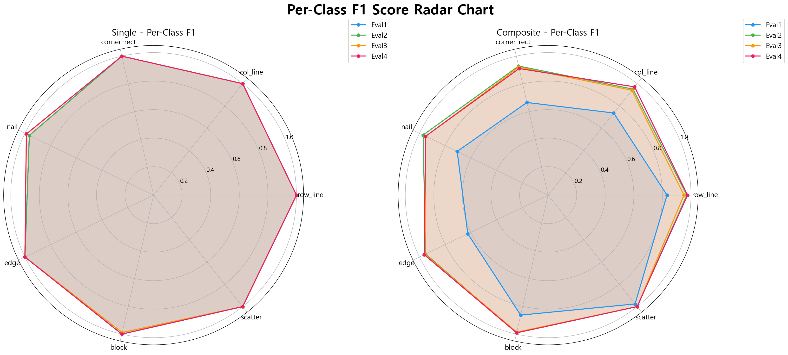

<details>
<summary><b>해석 가이드 (클릭하여 펼치기)</b></summary>

- **레이더 차트**: 정다각형(7각형)의 각 꼭짓점이 클래스, 중심=0, 외곽=1.0
- **면적이 넓고 균일할수록 좋음** → 모든 클래스에서 고르게 높은 F1
- **왼쪽 (Single)**: 모든 Eval이 거의 외곽에 달라붙어 있음 → 단일에서는 모두 우수
- **오른쪽 (Composite)**:
  - Eval1(파란색)이 크게 찌그러진 형태 → `edge`, `corner_rect`에서 특히 낮은 F1
  - Eval2~4는 거의 원형에 가까움 → 균형 잡힌 성능
  - Eval4(분홍색)가 `corner_rect`, `nail` 방향으로 약간 안쪽 → 이 클래스에서 상대적 약점
</details>

### 4. Precision & Recall 비교

Eval1의 **Recall 부족** 문제가 가장 뚜렷하게 드러나는 차트. 합성 데이터 추가 후 Recall이 대폭 개선됨.

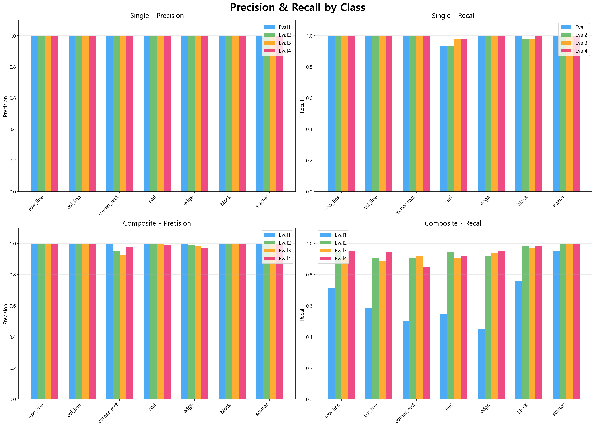

<details>
<summary><b>해석 가이드 (클릭하여 펼치기)</b></summary>

- **Precision** (정밀도): 모델이 "있다"고 예측한 것 중 실제로 맞는 비율
  - 높으면 → 거짓 양성(False Positive)이 적음
- **Recall** (재현율): 실제 "있는" 것 중 모델이 찾아낸 비율
  - 높으면 → 놓치는 것(False Negative)이 적음

**핵심 패턴**:
- **Composite - Precision**: Eval1도 높은 Precision (90%+) → "있다"고 말하면 대체로 맞지만...
- **Composite - Recall**: Eval1의 Recall이 매우 낮음 (50~65%) → **"있는데 못 찾는"** 문제가 핵심
- 이는 단일 패턴만 학습한 모델이 중첩 이미지에서 **하나의 패턴만 감지하고 나머지를 놓치는** 현상
- Eval2~4에서 Recall이 90%+로 개선 → 합성 중첩 데이터가 이 문제를 해결
</details>

### 5. 샘플 예측 결과

중첩 테스트 이미지에 대한 각 평가 조건의 실제 예측 결과. 초록색=정답, 빨간색=오답.

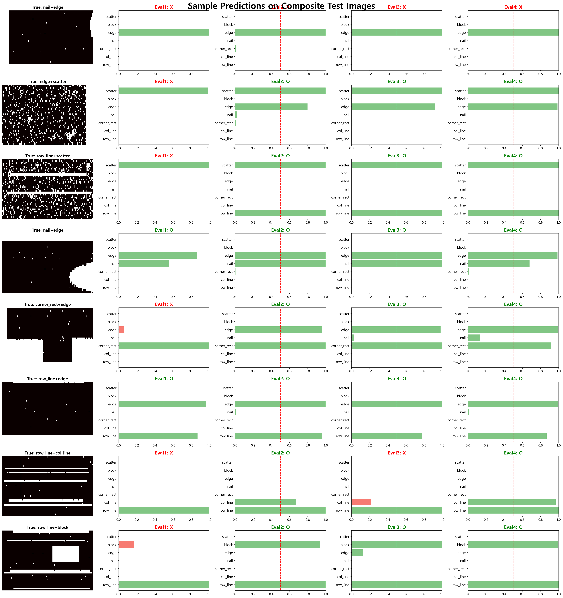

<details>
<summary><b>해석 가이드 (클릭하여 펼치기)</b></summary>

- **맨 왼쪽 열**: 원본 FBM 이미지 + 실제 정답 라벨 (예: `row_line+block`)
- **나머지 4열**: Eval1~4 각각의 예측 결과
  - 가로 막대 = 각 클래스에 대한 예측 확률 (0~1)
  - **빨간 점선**: threshold=0.5 기준선
  - **초록색 막대**: 정답과 일치하는 예측
  - **빨간색 막대**: 정답과 불일치하는 예측
  - 제목의 **O** = 전체 벡터 정답 (Exact Match), **X** = 하나라도 불일치

**관찰 포인트**:
- Eval1에서 X가 많음 → 중첩 이미지에서 두 번째 패턴의 확률이 0.5 미만으로 떨어짐
- Eval2~4에서 O가 많음 → 두 패턴 모두 0.5 이상으로 올바르게 예측
</details>

### 6. Detection Model Attention Maps

Eval4 모델의 Spatial Attention Map. 각 클래스가 이미지의 다른 공간 영역에 집중하는 것을 확인.

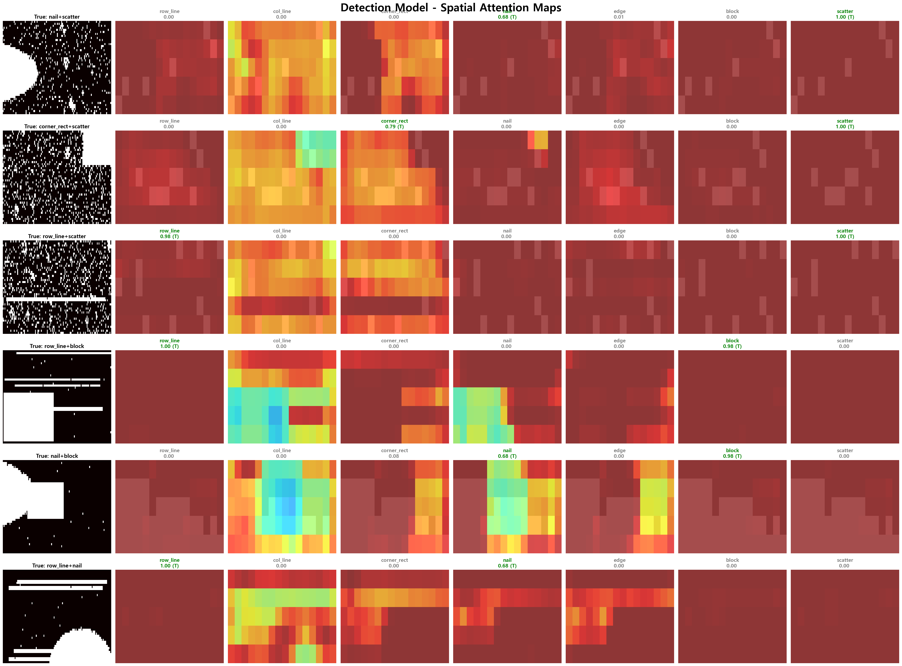

<details>
<summary><b>해석 가이드 (클릭하여 펼치기)</b></summary>

**차트 구조**:
- **행(Row)** = 각각 다른 중첩 테스트 샘플 (composite test image)
- **맨 왼쪽 열** = 원본 FBM 이미지 + 실제 정답 라벨 (예: `True: nail+scatter`)
- **나머지 7개 열** = 7개 클래스 각각의 Spatial Attention Map

**각 셀(Attention Map) 읽는 법**:
- **노란색/초록색 (밝은 색)** = 높은 attention → 모델이 "이 영역에 해당 패턴이 있다"고 강하게 주목
- **어두운 빨간/갈색** = 낮은 attention → 모델이 해당 영역에 관심 없음

**셀 위의 텍스트**:
- 클래스 이름 (예: `row_line`, `nail`)
- 예측 확률 (예: `0.98`)
- **(T)** 표시 = 실제로 해당 패턴이 존재하는 True 클래스 (초록색 글씨)

**좋은 신호 vs 나쁜 신호**:

| 관찰 포인트 | 좋은 신호 | 나쁜 신호 |
|---|---|---|
| **(T) 클래스의 attention** | 실제 결함 위치에 밝은 색 집중 | 엉뚱한 영역에 집중하거나 전체적으로 어두움 |
| **비-(T) 클래스의 attention** | 전체적으로 어두움 (낮은 확률) | 밝은 영역이 많음 (False Positive 위험) |
| **두 (T) 클래스 간** | 서로 다른 영역에 집중 (공간 분리) | 같은 영역에 겹침 (혼동 가능성) |

**핵심 인사이트**: 이 시각화의 본질적 의미는 **"모델이 정답을 맞추는 것뿐 아니라, 올바른 이유로(올바른 위치를 보고) 맞추는지"** 를 확인하는 것입니다. Attention이 실제 결함 위치와 일치하면 모델의 판단이 신뢰할 만하고, 엉뚱한 곳을 보면서 맞추면 우연히 맞춘 것일 수 있습니다.
</details>

### 7. Binary Classifier Probability Distribution

각 클래스(binary classifier)별로 실제 라벨이 0(패턴 없음)인 샘플과 1(패턴 있음)인 샘플의 **예측 확률 분포**를 시각화하여, 0과 1이 얼마나 잘 분리되는지 진단합니다.

- **파란색**: label=0 샘플의 예측 확률 → 0에 가까울수록 좋음
- **빨간색**: label=1 샘플의 예측 확률 → 1에 가까울수록 좋음
- **Sep**: Mean Separation (μ₁ - μ₀) → 1에 가까울수록 잘 분리됨
- **FPR**: False Positive Rate → 없는데 있다고 잘못 예측한 비율
- **FNR**: False Negative Rate → 있는데 없다고 놓친 비율

**Eval1 (단일 학습) - 중첩 테스트**: label=1 분포가 0.2~0.7 사이에 넓게 퍼져 있어 **심각한 분리 실패**

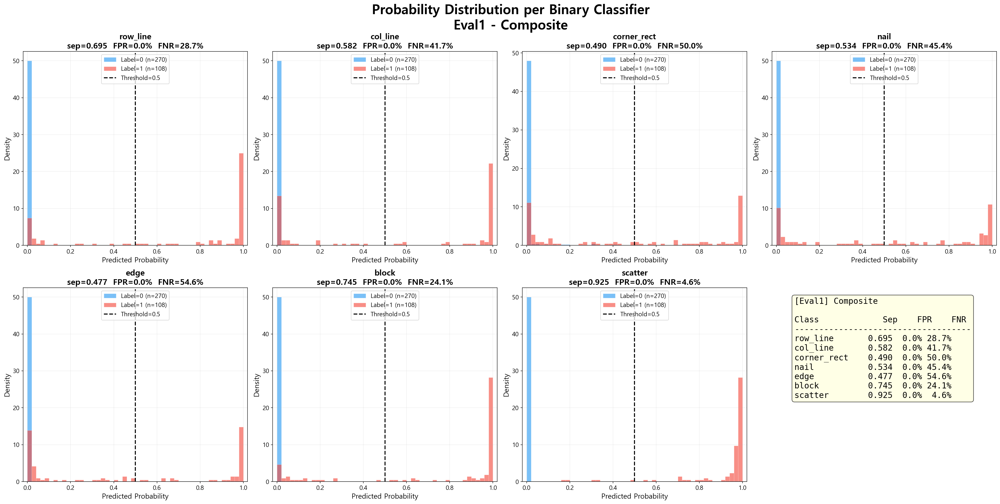

**Eval2 (합성 중첩) - 중첩 테스트**: 대부분 클래스에서 0/1 분포가 양 극단으로 명확히 분리

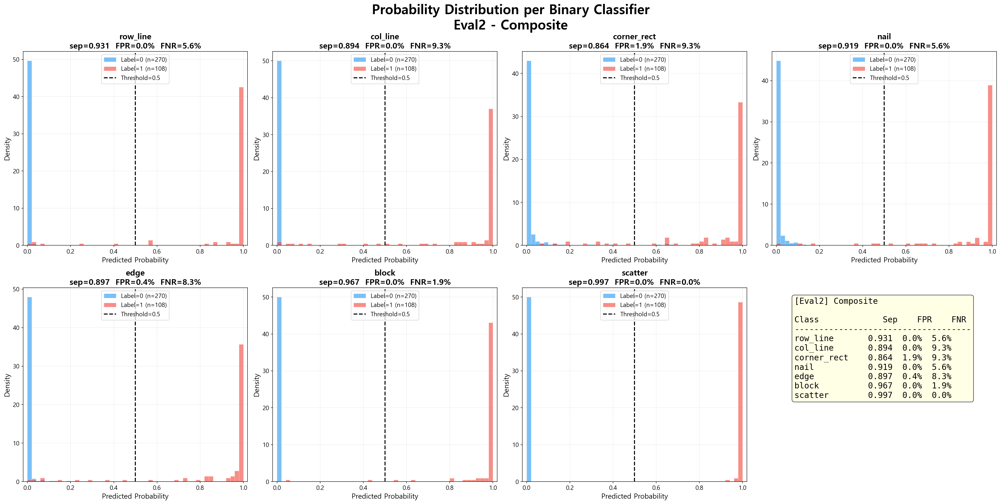

**Eval4 (Detection) - 중첩 테스트**: 가장 깔끔한 분리. 단, `corner_rect`(sep=0.734)과 `nail`(sep=0.628)은 상대적으로 약함

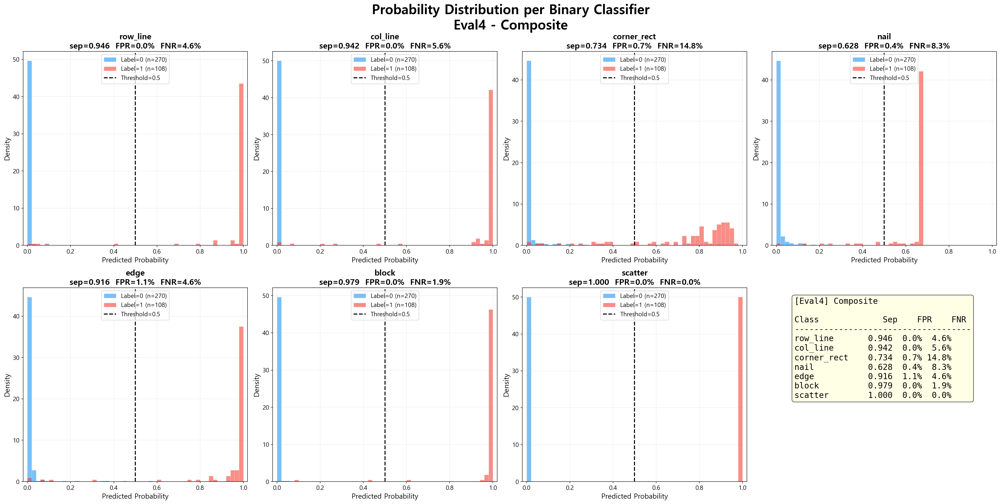

<details>
<summary><b>Probability Distribution 상세 해석 가이드 (클릭하여 펼치기)</b></summary>

**이상적인 분포 vs 문제 있는 분포**:

```
이상적 (Sep ≈ 1.0):              문제 (Sep < 0.7):

  label=0    label=1               label=0  label=1
    ██           ██                   ██   ████
    ██           ██                   ████ ████
    ████         ████                 ████████████
  ──┼──┼──┼──┼──┼──               ──┼──┼──┼──┼──┼──
  0.0    0.5    1.0               0.0    0.5    1.0
  → 분포가 양 극단에 분리            → 분포가 0.5 근처에서 겹침
  → 모델이 확신을 갖고 분류           → threshold 근처에서 혼동 발생
```

**지표별 의미**:
- **Sep (Mean Separation)**: label=1의 평균 확률 - label=0의 평균 확률. 0.9+ 이면 우수, 0.7 미만이면 주의
- **FPR (False Positive Rate)**: label=0인데 확률이 0.5 이상으로 잘못 예측 → 높으면 과탐지
- **FNR (False Negative Rate)**: label=1인데 확률이 0.5 미만으로 놓침 → 높으면 미탐지

**Eval별 패턴**:
- Eval1: 빨간 분포(label=1)가 0.3~0.6에 넓게 퍼짐 → 모델이 "있는지 없는지" 확신을 못함
- Eval2: 양쪽 분포가 0과 1 근처에 집중 → 확신 있는 분류
- Eval4: 대부분 우수하나, `corner_rect`/`nail`에서 빨간 분포의 꼬리가 0.5 아래로 내려감
</details>

**종합 비교**: 4개 평가 × 7개 클래스의 Mean Separation과 FNR을 한눈에 비교

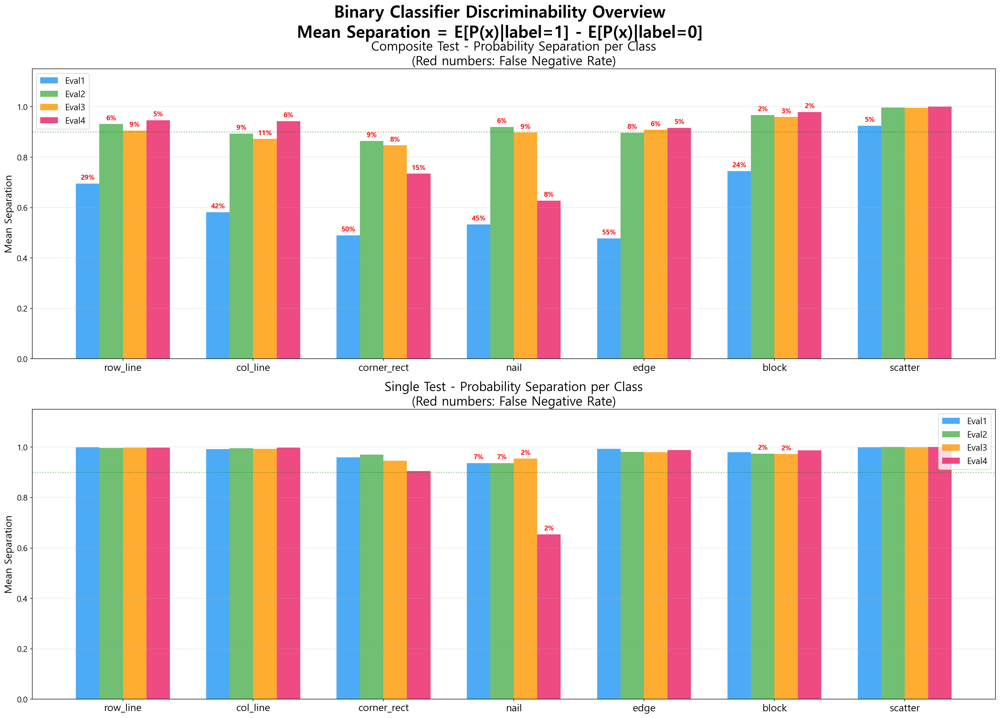

| 클래스 | Eval1 Sep(FNR) | Eval2 Sep(FNR) | Eval3 Sep(FNR) | Eval4 Sep(FNR) |
|---|:---:|:---:|:---:|:---:|
| `row_line` | 0.695 (29%) | 0.931 (6%) | 0.905 (9%) | **0.946 (5%)** |
| `col_line` | 0.582 (42%) | 0.894 (9%) | 0.872 (11%) | **0.942 (6%)** |
| `corner_rect` | 0.490 (50%) | **0.864 (9%)** | 0.847 (8%) | 0.734 (15%) |
| `nail` | 0.534 (45%) | **0.919 (6%)** | 0.897 (9%) | 0.628 (8%) |
| `edge` | 0.477 (55%) | 0.897 (8%) | **0.908 (6%)** | 0.916 (5%) |
| `block` | 0.745 (24%) | 0.967 (2%) | 0.959 (3%) | **0.979 (2%)** |
| `scatter` | 0.925 (5%) | 0.997 (0%) | 0.996 (0%) | **1.000 (0%)** |

> **주요 발견**: Eval4(Detection)는 전체적으로 가장 높은 Subset Accuracy를 달성했지만, Probability Distribution에서 보면 `corner_rect`와 `nail`의 separation이 Eval2보다 오히려 낮습니다. 이는 Spatial Attention Head가 공간적으로 넓은 영역을 차지하는 패턴(block, row_line, scatter)에서는 강점을 보이지만, 코너나 곡면 같은 국소적 형태 패턴에서는 표준 CNN의 global feature가 더 효과적일 수 있음을 시사합니다.

---

## Model Architecture

### Standard CNN Classifier (Eval 1~3)

```
Input: 1 x 46 x 128 (Grayscale FBM)
  │
  ├── Conv2d(1→32) + BN + ReLU + MaxPool2d(2)     → 32 x 23 x 64
  ├── Conv2d(32→64) + BN + ReLU + MaxPool2d(2)    → 64 x 11 x 32
  ├── Conv2d(64→128) + BN + ReLU + MaxPool2d(2)   → 128 x 5 x 16
  ├── Conv2d(128→256) + BN + ReLU + AdaptiveAvgPool(1) → 256 x 1 x 1
  │
  ├── Dropout(0.3)
  └── Linear(256→7)  ← raw logits

Output: 7 logits → Sigmoid → Threshold(0.5)
Parameters: ~406K
```

### Spatial Attention Detection Model (Eval 4)

```
Input: 1 x 46 x 128
  │
  ├── Backbone (Shared Feature Extraction)
  │   ├── Conv(1→32) + BN + ReLU + MaxPool    → 32 x 23 x 64
  │   ├── Conv(32→64) + BN + ReLU + MaxPool   → 64 x 11 x 32
  │   ├── Conv(64→128) + BN + ReLU + MaxPool  → 128 x 5 x 16
  │   └── Conv(128→256) + BN + ReLU           → 256 x 5 x 16
  │
  ├── Per-Class Spatial Attention Heads (×7)
  │   ├── Conv1x1(256→64) + ReLU + Conv1x1(64→1) + Sigmoid
  │   └── → Attention Map (1 x 5 x 16) per class
  │
  ├── Attended Feature Aggregation
  │   └── (feature × attention).mean(spatial) → 256-dim per class
  │
  └── Per-Class FC: Linear(256→64) + ReLU + Dropout + Linear(64→1)

Output: 7 logits → Sigmoid → Threshold(0.5)
Parameters: ~620K
```

**핵심 차이**: Standard CNN은 `AdaptiveAvgPool`로 공간 정보를 완전히 압축하지만, Detection 모델은 **클래스별 독립 Attention Map**으로 각 결함의 공간 위치를 보존하여 탐지합니다.

---

## Project Structure

```
fbm_classification/
├── README.md                    # 프로젝트 문서 (본 파일)
├── requirements.txt             # 의존성 패키지
├── fbm_model.py                 # CNN 모델 정의 (FBMClassifier)
├── generate_fbm_data.py         # 합성 FBM 데이터 생성 (단일 + 중첩)
├── train.py                     # 기본 학습 + 평가 스크립트
├── run_evaluation.py            # ★ 종합 평가 파이프라인 (Eval 1~4)
├── detect.py                    # CLI 추론 스크립트
├── webcam_detect.py             # GUI(tkinter) 추론 애플리케이션
├── generate_sample_images.py    # README용 샘플 이미지 생성
│
├── docs/images/                 # README 시각화 이미지
│   ├── 01_overall_comparison.png
│   ├── 02_per_class_heatmap.png
│   ├── 03_f1_radar_chart.png
│   ├── 04_precision_recall.png
│   ├── 05_sample_predictions.png
│   ├── 06_detection_attention_maps.png
│   └── sample_*.png            # 패턴 샘플 이미지
│
├── data/eval_dataset/           # (생성됨) 평가용 데이터셋
│   ├── train_single/            # Eval1 학습 데이터
│   ├── train_composite/         # Eval2~4 학습 데이터
│   ├── test_single/             # 단일 패턴 테스트셋
│   └── test_composite/          # 중첩 패턴 테스트셋
│
└── runs/evaluation/             # (생성됨) 평가 결과
    ├── eval1_best.pt ~ eval4_best.pt
    └── visualizations/          # 시각화 결과
```

---

## Quick Start

### 1. Install Dependencies
```bash
pip install -r requirements.txt
```

> NVIDIA GPU 사용 시:
> ```bash
> pip install torch torchvision --index-url https://download.pytorch.org/whl/cu121
> ```

### 2. Run Full Evaluation Pipeline (권장)

```bash
python run_evaluation.py
```

이 스크립트 하나로 **데이터 생성 → 4가지 평가 학습/테스트 → 시각화**가 자동으로 수행됩니다.

옵션:
```bash
python run_evaluation.py --epochs 50 --count 500 --batch-size 64
```

| 옵션 | 기본값 | 설명 |
|---|---|---|
| `--epochs` | 30 | 학습 에포크 수 |
| `--count` | 300 | 클래스당 이미지 수 |
| `--batch-size` | 32 | 배치 크기 |
| `--lr` | 0.001 | 학습률 |
| `--seed` | 42 | 랜덤 시드 |

### 3. Basic Training (단일 학습만)

```bash
python generate_fbm_data.py   # 데이터 생성
python train.py --epochs 30   # 학습
```

### 4. Inference

```bash
# CLI
python detect.py --source path/to/image.png

# GUI
python webcam_detect.py
```

---

## Key Design Decisions

### Multi-Label vs Multi-Class

| | Multi-Class (기존) | Multi-Label (본 프로젝트) |
|---|---|---|
| 출력층 | Softmax (합=1) | Sigmoid (각 독립) |
| Loss | CrossEntropyLoss | BCEWithLogitsLoss |
| 중첩 감지 | 불가능 | **가능** |
| 라벨 형식 | 단일 정수 (0~7) | 이진 벡터 `[0,1,0,1,0,0,1]` |

### 합성 데이터 전략

- 2개 패턴을 **OR 연산**으로 합성 (픽셀 단위 중첩)
- C(7,2) = 21가지 조합 × 60장
- 합성만으로도 **+58%p Subset Accuracy 향상** 달성

### Masking Augmentation (Eval 3)

- **Cutout** 기법 적용: 이미지의 10~30% 영역을 랜덤으로 마스킹
- 70% 확률로 1~3개 마스크 적용
- 부분 정보만으로 패턴 인식 → occlusion 내성 강화 의도

### Spatial Attention Detection (Eval 4)

- 기존 GAP 대신 **클래스별 독립 Spatial Attention** 적용
- 각 결함 유형의 공간 위치를 독립적으로 탐지
- Attention Map으로 모델의 판단 근거를 시각적으로 해석 가능

---

## Environment

| 항목 | 값 |
|---|---|
| GPU | NVIDIA GeForce RTX 3080 (10GB VRAM) |
| CUDA | 12.1 |
| PyTorch | 2.5.1+cu121 |
| Python | 3.x |
| Training Time | ~2분 (4개 모델 × 30 epochs) |

---

## License

MIT License
